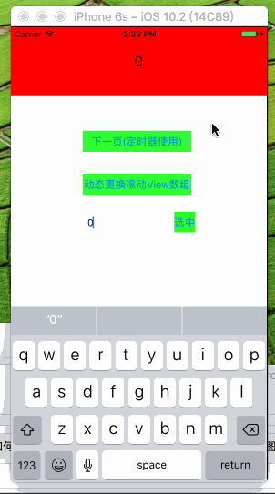
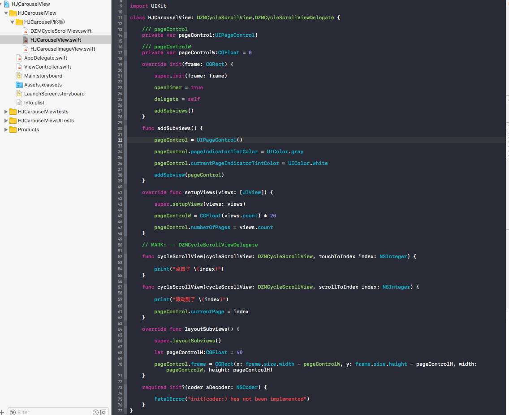

# DZMCycleScrollView


***
#### 效果:


***
#### 简介:

    iOS11已适配 - 可通过 contentInsetAdjustmentBehavior 属性进行控制

    通过使用 ScrollView 进行无限滚动。
    
    与一般无限滚动控件不同的地方: 通常都是通过传入Images数组,或者什么模型数组进行轮播。
    
    本Demo是直接传入自定义Views(视图数组进行无限轮播),无内存泄漏问题
    
    同时也支持viewControllers(控制器数组)使用。
    
    UIPageControl可在继承该控件之后自己添加即可,有代理回调,下面有例子
    
    一个Bool值决定是否能无限滚动
    
    一个Bool值决定是否使用定时器进行自动轮播
    
    也支持不使用内部定时器,使用自己的定时器 在定时器调用里面一行 next() 实现自定下一页滚动
    
    ......
    
***
#### 代码介绍 ( Swift ) :

##### 创建方法例子:

```Swift
cycleScrollView = DZMCycleScrollView.cycleScrollView(views: [view1,view2,view3,view4],limitScroll: true, delegate:self)

view.addSubview(cycleScrollView)

cycleScrollView.frame = CGRect(x: 0, y: 0, width: UIScreen.main.bounds.size.width, height: 100)
```

##### 创建方法例子（ 属性都有默认值 ）:

```Swift
cycleScrollView = DZMCycleScrollView()

cycleScrollView.delegate = self

// 是否开启无限滚动
cycleScrollView.limitScroll = true

// 动画时间
cycleScrollView.animateDuration = 0.25

// 初始化选中页面
cycleScrollView.initSelectIndex = 0

// 是否开启点击手势
cycleScrollView.openTap = false

// 允许滚动控件有额外滚动区域
cycleScrollView.bounces = true

// 添加定时器
cycleScrollView.openTimer = true

// 定时器间隔时间
cycleScrollView.timeInterval = 1.0

// 传view数组即可 包括 控制器View
cycleScrollView.setupViews(views: [view1,view2,view3,view4])

view.addSubview(cycleScrollView)

cycleScrollView.frame = CGRect(x: 0, y: 0, width: UIScreen.main.bounds.size.width, height: 100)
```

***
#### 内部方法介绍：
```Swift
// 调用即可滚动到下一页
cycleScrollView.next()

// 选定并滚动到指定位置
cycleScrollView.selectIndex(index: NSInteger, animated: Bool)

// setupViews() 设置滚动Views 在有值情况下使用该方法赋值可以重置为新的Views
cycleScrollView.setupViews(views: [view1,view2])

// 使用原有的Views重置页面（类似TableView的数据源）
// 使用场景: 比如你本来是不是有定时器的,你可以直接修改 cycleScrollView.openTimer = true ,再使用 reloadData() 则会重置UI
// 使用场景: 比如你修改了动画时间或者取消了无限滚动,再使用 reloadData() 则会重置UI
cycleScrollView.reloadData()
```

***
#### 代理:
```Swift
@objc protocol DZMCycleScrollViewDelegate:NSObjectProtocol {

    /// 开始拖拽
    @objc optional func cycleScrollViewWillBeginDragging(cycleScrollView:DZMCycleScrollView)

    /// 结束拖拽
    @objc optional func cycleScrollViewDidEndDragging(cycleScrollView:DZMCycleScrollView)

    /// 正在滚动
    @objc optional func cycleScrollViewDidScroll(cycleScrollView:DZMCycleScrollView)

    /// 准备减速
    @objc optional func cycleScrollViewWillBeginDecelerating(cycleScrollView:DZMCycleScrollView)

    /// 停止滚动
    @objc optional func cycleScrollViewDidEndDecelerating(cycleScrollView:DZMCycleScrollView)

    /// 滚动到哪一个index
    @objc optional func cycleScrollView(cycleScrollView:DZMCycleScrollView,scrollToIndex index:NSInteger)

    /// 点击了哪一个index
    @objc optional func cycleScrollView(cycleScrollView:DZMCycleScrollView,touchToIndex index:NSInteger)
}
```

***
#### UIPageControl 例子:

